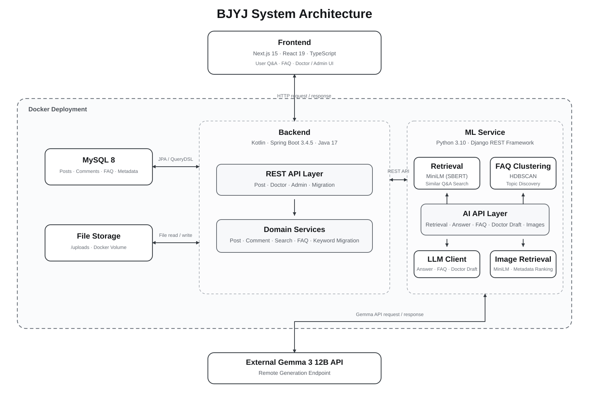
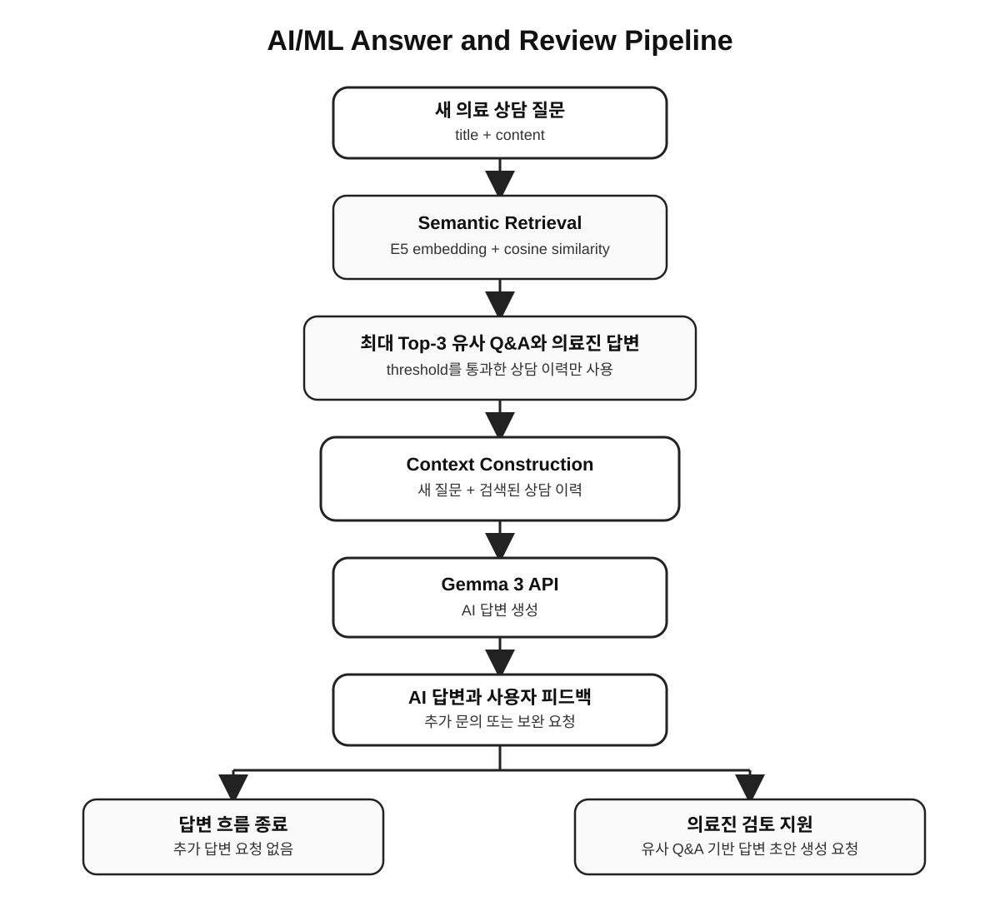
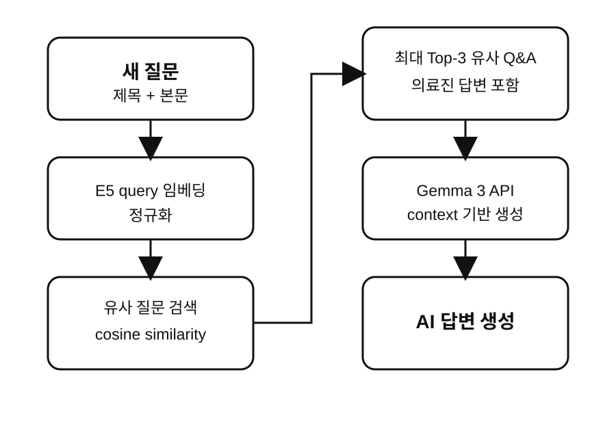
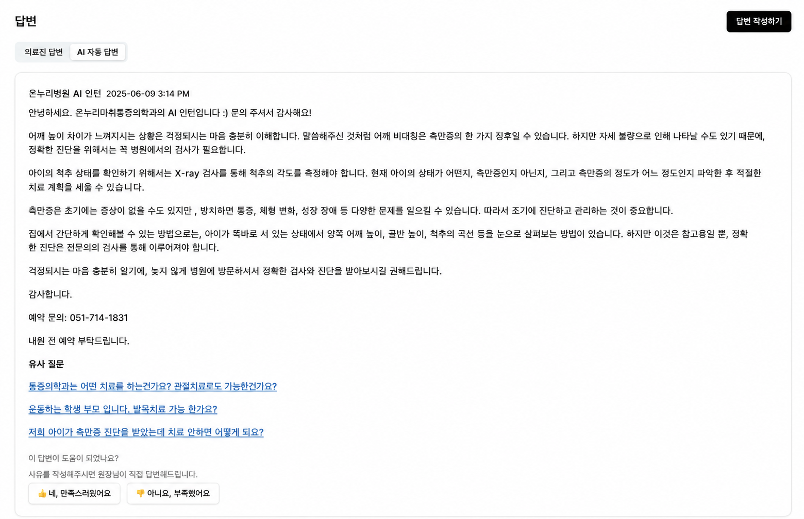
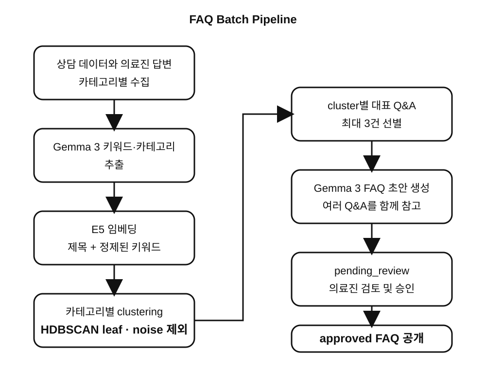
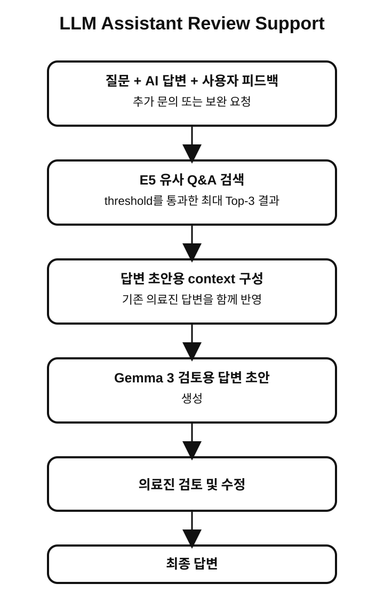

# BJYJ-ML

AI/NLP 기반 의료 Q&A 자동화 시스템입니다.
과거 상담 데이터를 활용한 **semantic retrieval, FAQ generation, AI answer generation, doctor review support**를 하나의 서비스 파이프라인으로 구성합니다.

  
  
  
  
  

  <a href="#overview">Overview</a>
  ·
  <a href="#system-architecture">System Architecture</a>
  ·
  <a href="#service-pipeline">Service Pipeline</a>
  ·
  <a href="#tech-stack">Tech Stack</a>
  ·
  <a href="#service-domains">Service Domains</a>
  ·
  <a href="#ai-pipeline">AI Pipeline</a>
  ·
  <a href="#quality--validation">Quality</a>
  ·
  <a href="#development">Development</a>
  ·
  <a href="#developer">Developer</a>

## Overview

병원 Q&A 게시판에는 증상, 진단, 시술, 예약, 비용, 생활 관리처럼 비슷한 주제의 문의가 반복됩니다. 하지만 환자마다 표현 방식이 달라 단순한 제목이나 키워드 검색만으로는 적절한 과거 상담을 안정적으로 찾기 어렵습니다.

**BJYJ-ML**은 질문의 의미와 문맥을 embedding으로 표현해 과거 상담을 검색하고, 검색된 질문과 의료진 답변을 생성 모델의 context로 활용합니다. 축적된 상담 데이터는 topic별로 clustering하여 FAQ 초안으로 정리하고, AI 답변 이후 추가 feedback이 발생한 문의는 의료진 검토용 답변 초안 생성으로 연결합니다.

이 프로젝트의 핵심은 LLM을 단독으로 사용하는 것이 아니라 **retrieval, clustering, generation, review flow를 하나의 pipeline으로 연결하는 것**입니다.

- **Semantic Retrieval**: 현재 질문과 관련된 과거 상담을 검색합니다.
- **AI Answer Generation**: 검색된 Q&A와 의료진 답변을 참고해 답변을 생성합니다.
- **FAQ Generation**: 반복되는 상담 topic을 clustering하여 FAQ draft를 생성합니다.
- **Doctor Review Support**: AI 답변과 사용자 feedback을 바탕으로 의료진 검토용 draft를 생성합니다.
- **Medical Image Recommendation**: 질문과 image metadata의 semantic similarity를 이용해 참고 이미지를 추천합니다.

## System Architecture

  

전체 서비스는 frontend, 도메인 backend, AI/ML serving layer로 분리됩니다. 이 저장소는 Django REST Framework 기반의 AI/ML serving을 담당하며, 의미 검색, FAQ 초안 생성, AI 답변, 의료진 검토용 초안, 이미지 추천 API를 제공합니다.

## Service Pipeline

  

환자 질문은 AI/ML serving layer를 거쳐 의미 검색과 생성 흐름으로 전달됩니다. 검색된 과거 Q&A와 의료진 답변은 AI 답변 및 의료진 검토용 초안의 context가 되고, FAQ는 요청 처리와 분리된 batch 작업으로 생성한 뒤 검토를 거쳐 공개합니다.

## Tech Stack

### AI / NLP

- **Semantic Retrieval**: Sentence Transformers, `intfloat/multilingual-e5-small`, cosine similarity
- **FAQ Clustering**: E5 embedding, cosine distance, `sklearn.cluster.HDBSCAN`
- **Answer Generation**: Gemma 3 12B compatible remote API
- **Image Recommendation**: `all-MiniLM-L6-v2` embedding

### Serving / Integration

- Python 3.10, Django 4.2.22
- Django REST Framework 3.16.0, drf-yasg Swagger UI
- django-cors-headers, SQLite
- 환경변수 기반 Gemma API 연동과 AI/ML inference API serving

### Data / Infrastructure

- Historical Q&A, doctor answer, image metadata, FAQ draft, validation record
- Dockerfile, Docker Compose, environment-based LLM configuration

## Service Domains

- **Question Understanding**: 의료 keyword와 상담 category 추출
- **Similar Consultation Retrieval**: similarity threshold 기반 과거 상담 검색
- **AI Answer**: 과거 Q&A와 의료진 답변을 활용한 답변 생성
- **FAQ**: category별 clustering, representative Q&A selection, review state 관리
- **Doctor Support**: 사용자 feedback과 유사 상담을 활용한 review draft 생성
- **Image Recommendation**: image metadata embedding 기반 참고 이미지 추천

## AI Pipeline

### Semantic Retrieval & AI Answer

  

새 질문과 과거 상담을 동일한 `제목 + 본문` 표현으로 비교하고, 관련 사례만 최대 **Top-3**까지 답변 context에 사용합니다.

현재 retrieval model은 `intfloat/multilingual-e5-small`입니다. 저장소 Q&A 기반 검증에서 관련 상담 검색과 불필요한 사례 제외 성능이 가장 높아 선택했습니다. 후보별 점수, prefix·threshold 설정, 재현 명령은 [DEV.md의 Retrieval Benchmark](./DEV.md#retrieval-benchmark)에 정리했습니다.

  

서비스에서는 생성된 AI 답변과 함께 관련성이 높은 기존 질문을 제공합니다. 사용자가 추가 feedback을 남기면 해당 내용은 doctor review flow로 전달됩니다.

### FAQ Generation

  

FAQ clustering에는 retrieval과 다른 representation을 사용합니다. 긴 본문 대신 **제목 + 정제된 keyword**를 embedding하고, 밀도가 낮은 질문은 억지로 cluster에 포함하지 않고 noise로 유지합니다.

선택한 HDBSCAN 방식은 일부 큰 cluster에 질문이 몰리는 현상을 완화하고 밀도가 있는 세부 topic을 분리합니다. 신뢰할 수 있는 cluster가 형성되지 않는 category에는 FAQ를 생성하지 않습니다. 후보 조합, 선택 파라미터, 진단 지표와 비교 결과는 [DEV.md의 FAQ Clustering Benchmark](./DEV.md#faq-clustering-benchmark)에서 확인할 수 있습니다.

FAQ draft는 API 요청 중 생성하지 않고 batch job으로 생성합니다. 새 draft는 `pending_review` 상태이며, `approved` 항목만 FAQ API에 노출합니다.

### Doctor Review Support

  

AI 답변만으로 해결되지 않은 문의에는 기존 AI 답변, 사용자 feedback, 유사 상담과 해당 상담의 의료진 답변을 함께 제공합니다.

Gemma 3는 이를 바탕으로 의료진 검토용 답변 초안을 생성합니다. 결과는 최종 의료 답변이 아니라 의료진이 검토하고 수정하기 위한 참고 자료입니다.

### Medical Image Recommendation

질문과 `docs/medical_metadata.json`의 image description을 embedding한 뒤 cosine similarity를 비교해 관련성이 높은 이미지 5건을 추천합니다.

Image recommendation에는 `all-MiniLM-L6-v2`를 사용합니다.

## Quality & Validation

요청 검증, LLM 장애 처리, 모델 지연 로딩, FAQ 승인 제어를 적용합니다. 검증 기준과 재시도 범위는 [DEV.md의 Runtime Behavior](./DEV.md#runtime-behavior), 테스트 방법은 [DEV.md의 Tests](./DEV.md#tests)에서 확인할 수 있습니다.

### Current Limitations

- Retrieval과 generation 품질은 축적된 상담 데이터와 의료진 답변 품질에 영향을 받습니다.
- 일부 category는 충분한 density를 형성하지 못해 전체가 noise로 남을 수 있습니다.
- model 최초 호출 시 download와 index 생성으로 초기 latency가 발생할 수 있습니다.
- AI answer와 doctor draft는 전문적인 의료 판단을 대체하지 않으며 실제 상담에는 의료진 검토가 필요합니다.
- 현재 pipeline은 통증의학과 상담 데이터를 중심으로 구성되어 다른 진료 분야에는 별도 validation이 필요합니다.

## API

| Method | Endpoint | Description |
| --- | --- | --- |
| POST | `/api/api/similar-posts/` | 유사 과거 상담을 최대 3건 조회 |
| POST | `/api/api/ai-answer/` | 과거 Q&A와 의료진 답변을 참고해 AI 답변 생성 |
| POST | `/api/api/doctor-draft/` | AI 답변과 사용자 feedback을 활용해 doctor draft 생성 |
| POST | `/api/api/extract-keywords/` | 의료 keyword와 상담 category 추출 |
| GET | `/api/api/faqs/` | 승인된 FAQ draft 반환 |
| POST | `/api/recommend-images/` | 질문 기반 의료 이미지 5건 추천 |
| GET | `/swagger/` | 개발 환경 Swagger UI |

## Development

로컬 실행, Docker, 환경변수, benchmark, 테스트 절차는 [DEV.md](./DEV.md#local-setup)에서 관리합니다. 기본 개발 서버 주소는 `http://127.0.0.1:8000/`입니다.

## Documentation

| Document | Purpose |
| --- | --- |
| [DEV.md](./DEV.md) | 개발 환경, 데이터 경로, 검증·운영 절차 |
| [Retrieval benchmark record](./docs/validation/retrieval-benchmark-v1.json) | 검색 모델 선정 기록 |
| [FAQ clustering benchmark record](./docs/validation/faq-clustering-benchmark-v1.json) | FAQ 설정 선정 기록 |
| [FAQ draft guide](./docs/faq_drafts/README.md) | FAQ 초안 생성과 승인 상태 |

## Developer

본 프로젝트는 팀 프로젝트로 진행되었으며, 주요 기여 영역은 다음과 같습니다.

<table>
  <tr height="155px">
    <td align="center" width="190px">
      
       
      <a href="https://github.com/Nutriatree"><strong>Jiwoo Park</strong></a>
       
      AI Pipeline · Model & Method Design
    </td>
    <td align="center" width="190px">
      
       
      <a href="https://github.com/alicek0"><strong>alicek0</strong></a>
       
      Data Pipeline · Service Integration
        
      <strong>Contribution Area</strong>
       
      Data Collection · Data Preprocessing
    </td>
    <td align="center" width="190px">
      
       
      <a href="https://github.com/banseok1216"><strong>banseok1216</strong></a>
       
      Runtime · Deployment Configuration
    </td>
    <td align="center" width="190px">
      
       
      <a href="https://github.com/TaeheeKk"><strong>TaeheeKk</strong></a>
       
      Initial AI Pipeline · Prototyping
    </td>
  </tr>
</table>
